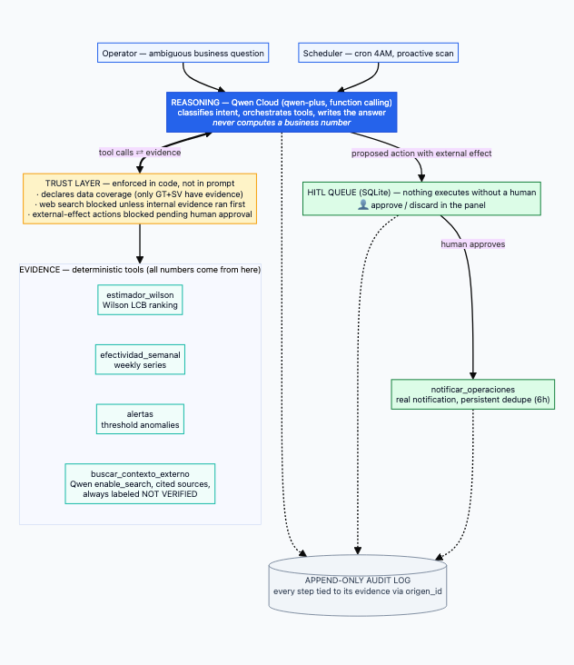

# WebCorp Autopilot

**Track 4 — Autopilot Agent · Global AI Hackathon Series with Qwen Cloud**

> **This is the final submission repository.** It contains the complete, runnable source of the Autopilot agent, panel, optimizer and tests. The company's private analytics backend and production database are **deliberately not included** (data-privacy decision — see the note on demo data below); the public build runs fully on the included aggregated CSV snapshot and the declared synthetic fallback.

An operational decision agent running on the **real order data of WebCorp, a 3PL logistics company operating in 7 Latin American countries** (318K orders, 1.6M tracking events). It takes ambiguous business questions, answers with statistically honest evidence — it never invents a number — and **never executes an action with external effect without explicit human approval**, enforced in code, not in UI.

**Live demo:** http://8.219.56.30/panel/ (no login required — stays up through the full judging window, July 10–31)

---

## The problem

WebCorp's operation runs on last-mile carriers whose per-municipality performance varies wildly. Failures are invisible until someone digs through spreadsheets. As the business owner puts it:

> *"They don't notice — everything lives in Excel, so about 3 days. Or never."*

One concrete case from the data: a single municipality–carrier pair (Escuintla, Guatemala / FORZA) accumulated **24 failed deliveries in 90 days ≈ $2,188 USD in uncollected COD** — one pair, out of 700+.

## What it does

**Reactive mode** — an operator asks an ambiguous question ("why is FORZA doing badly?"). Qwen classifies the intent, calls deterministic tools, and writes a recommendation grounded in their output. Every number in the answer comes from a tool, with its sample size attached.

**Proactive mode** — a scheduler (cron, 4 AM daily on the Alibaba Cloud instance) runs the same loop with standing questions. Anything the agent wants to *do* about what it finds lands in an approval queue — the operator finds it waiting in the morning.

**Human-in-the-loop, enforced in code** — tools flagged with external effect (`notificar_operaciones`) are physically blocked in `ejecutar_tool()` unless `aprobado_por_humano=True`, which only the approval endpoint can set. The LLM cannot bypass it; neither can a prompt injection.

**Audit trail** — every question, tool call, block, approval and notification is appended to an immutable JSONL log, and every action carries the `origen_id` of the evidence that triggered it. The chain from data → recommendation → human decision → action is fully reconstructible.

## Architecture



Three layers, converging with the pattern used by enterprise agent platforms (reasoning → trust → action):

1. **Reasoning (Qwen, `qwen-plus`, function calling)** — orchestrates. Never computes a business number.
2. **Trust layer (plain code)** — declares data coverage per country, blocks external-effect tools pending human approval, and blocks web search unless internal evidence came first.
3. **Evidence & Action (5 deterministic tools)** — see below. All numbers are computed by code or SQL, not by the model.

| Tool | What it does | Trust constraint |
|---|---|---|
| `estimador_wilson` | Ranks municipality×carrier pairs by **Wilson lower confidence bound**, not raw rate | Declares country coverage + snapshot date on every call |
| `efectividad_semanal` | Weekly effectiveness series from the production backend | Read-only |
| `alertas` | Threshold anomalies (critical countries, month-over-month drops) with pre-written rationale | Read-only |
| `notificar_operaciones` | Real notification to operations, with persistent dedupe (SQLite, 6h window) | **Blocked until human approval** |
| `buscar_contexto_externo` | Web search (Qwen `enable_search`) for external causes — road blocks, weather, protests | **Blocked unless internal evidence ran first in the same loop**; result always labeled NOT VERIFIED, sources cited |

If Qwen Cloud is unreachable, a rules-only fallback answers from the alert thresholds — degraded but honest, and it says so.

## Statistical honesty (why Wilson, not raw rates)

Raw success rates lie at small sample sizes. From the actual dataset:

| Pair | Raw rate | n | Wilson LCB (95%) | Verdict |
|---|---|---|---|---|
| Chahal / FORZA | 100% | 1 | 20.7% | Insufficient evidence — looks perfect, means nothing |
| Yupiltepeque / CARGO | 84.9% | 53 | 72.9% | Solid evidence |
| Zacatecoluca (SV) / FORZA | 36.8% | 38 | 23.4% | **Worst reliable pair in the dataset** |

The agent ranks by the Wilson lower bound and refuses to compare countries that have no coverage in the artifact (only GT and SV do; HND/PAN/CR/NIC are declared as not covered — the agent says so instead of faking uniform coverage). The estimator is a batch snapshot (2026-06-24) and the agent cites that date on every use.

## Qwen Cloud usage — including gotchas we verified empirically

- **Function calling** (OpenAI-compatible endpoint) drives the whole loop, with `enable_thinking: false` (thinking mode is incompatible with tool calling).
- **`enable_search` + `enable_source`**: the OpenAI-compatible endpoint does **not** return `search_info` even when you request sources. Only the **native** DashScope endpoint (`/api/v1/services/aigc/text-generation/generation`) exposes `output.search_info.search_results` with URLs. `buscar_contexto_externo` calls the native endpoint for this reason.
- **Hallucination caught during testing, and the fix**: in early tests Qwen wrote a plausible "external context" section citing a newspaper article it invented — *without calling the search tool*. System prompt rule 7 now states that external context only exists if the tool returned it, and only tool-returned URLs may be cited. The re-test called the tool, found nothing specific, and answered: *"no external evidence found — the cause is internal until new evidence appears."* That honest null result is the behavior we ship.
- Search quality for hyperlocal Central American news is weak (the engine skews global/Chinese web); "no findings" is a frequent, valid, honestly-labeled outcome.

## What existed before vs. what was built during the submission period

| Existed before (pre-May 26) | Built during submission (May 26 – July 8) |
|---|---|
| FastAPI analytics backend (~20 read-only endpoints over the production MySQL — private, not in this repo) | `agent_tools.py` — the 5 tools, their schemas, trust flags, persistent dedupe |
| React ops dashboard (private) | `agente.py` — Qwen orchestrator, HITL queue, audit log, rules fallback, proactive scan |
| Wilson estimator generator (private; its aggregated CSV snapshot **is** included here) | `server.py` — HTTP API exposing the agent + serving the panel |
| Production order database (unchanged, read-only access) | `frontend/index.html` — HITL approval panel (matches the dashboard design system) |
| | `test_agente_mock.py` — 7-test suite covering the loop, HITL, dedupe, fallback, trust guards |
| | Alibaba Cloud deployment (ECS + systemd + cron) |

## Run it yourself (with your own data)

```bash
git clone https://github.com/steffanylars/webcorp-autopilot.git
cd webcorp-autopilot
python3 -m venv .venv && .venv/bin/pip install -r requirements.txt

export DASHSCOPE_API_KEY=sk-...          # your Qwen Cloud key
export QWEN_MODEL=qwen-plus
export ESTIMADOR_SNAPSHOT_DATE=2026-06-24 # date of your CSV snapshot

.venv/bin/python -m uvicorn server:app --port 8001
# panel:  http://localhost:8001/panel/
# tests (no tokens spent):  python3 test_agente_mock.py
```

The engine is domain-portable by replacing one file: `estimador_municipio_mensajeria.csv` (columns: `pais,depto,municipio,mensajeria,estrato,n,exitos,tasa_cruda,wilson_lcb`). Any operation with a success/failure rate across segments — field service, collections, claims — fits the same shape. Optional: point `WEBCORP_BACKEND_URL` at your own metrics API for the trend/alert tools, and `NOTIFY_WEBHOOK_URL` at a Slack/DingTalk webhook for real notifications (without it, notifications run in transparent demo mode and say so).

**Deployment (as running now):** Alibaba Cloud ECS (Singapore), Ubuntu, `systemd` unit with auto-restart, daily proactive scan via cron hitting `POST /escaneo`.

> **Note on demo data:** the public instance runs **synthetic demonstration data** whenever the real backend is not reachable — the production MySQL database is *deliberately not deployed* to the public instance (data privacy decision: it belongs to a real, operating business). The backend-dependent tools (`courier_zona`, `productos_real`) fall back automatically to `data/demo_sintetico.json` and **declare it** in their `fuente` field, so the agent says so instead of passing synthetic numbers off as real. Results with real WebCorp data are shown in the demo video, recorded locally with the authorization of the family that owns the business.

## The optimizer, mechanistically (no hand-waving)

**Formulation** — a generalized-assignment MILP, solved exactly with PuLP + CBC (`optimizador.py`, docstring and lines 69–93):

$$\max \sum_{z}\sum_{c} v_z \cdot \hat{p}^{\,\mathrm{LCB}}_{c,z} \cdot x_{c,z}$$

subject to

- $\sum_c x_{c,z} = 1$ for every zone $z$ — each zone is served by exactly one courier;
- $\sum_z v_z\,x_{c,z} \le (1+\gamma)\,V_c$ for every courier $c$ — nobody absorbs unbounded volume overnight ($V_c$ = the courier's current volume in the optimizable universe, $\gamma = 0.25$);
- $x_{c,z} \in \{0,1\}$, and **only observed pairs with $n \ge 30$ enter the model** — zones where a single courier has evidence are excluded: there is no decision to make there without inventing data.

Here $v_z$ is the zone's order volume over the snapshot window and $\hat{p}^{\mathrm{LCB}}_{c,z}$ is the **Wilson 95% lower confidence bound** of that courier's delivery rate in that zone — the same conservative yardstick used everywhere else in the system, never the raw rate. CBC certifies optimality (`status_solver: "Optimal"`); if the solver is unavailable, a greedy + 2-opt metaheuristic takes over **and declares itself** in the `metodo` field.

**The headline number is the conservative one.** The +921 deliveries/quarter is projected with the Wilson LCB — the pessimistic bound. Re-evaluating the *same* optimal plan with raw rates yields **+909**: the two metrics agree within ~1%, so the gain is not an artifact of the metric choice. Even under the bound designed to underestimate, the money is there.

**Capacity sensitivity (real solver runs, not a justification).** $\gamma$ is a free parameter; the solution barely depends on it:

| Capacity headroom $\gamma$ | Extra deliveries | Gain | USD / quarter | Changes |
|---|---|---|---|---|
| +10% | +893 | +6.61% | $35,911 | 14 |
| **+25% (shipped)** | **+921** | **+6.82%** | **$36,440** | **14** |
| +50% | +924 | +6.84% | $36,665 | 15 |

The recommendation set is essentially stable from +10% to +50%: the plan is driven by evidence quality, not by the capacity assumption.

## Assumptions & limitations of the optimization (declared, not hidden)

- **Transferability**: the model assumes a courier's historical zone performance holds under a ≤25% volume increase — congestion effects are not modeled. Reassignments are restricted to observed pairs ($n \ge 30$), so we never extrapolate to unseen courier×zone combinations.
- **Staleness**: effectiveness comes from a ~90-day batch snapshot (`ESTIMADOR_SNAPSHOT_DATE`); in production the estimator re-runs on a schedule and the plan is re-solved with each refresh.
- **Feedback loop**: reassigning by LCB starves the losing courier of new data in that zone, so it can never statistically "redeem" itself. Mitigation on the roadmap: an explore/exploit split (a small ε of volume kept on the runner-up, bandit-style) to keep estimates alive.
- **Gaming**: a carrier that knows it is measured against a threshold could mis-mark doubtful deliveries as successful. The append-only ledger keeps per-order traceability for spot audits; independent delivery-confirmation signals are the long-term fix.
- **USD estimate**: uses the country-level average ticket of *delivered COD orders* (real DB query, Jul 2026) — not all volume is COD, and the figure says so in the tool's declared assumptions.

## Non-goals (deliberate scope decisions)

- **No multi-agent negotiation and no custom MCP server** — one agent with deterministic tools was the honest scope for a working production system.
- **No demand forecasting** — the optimizer reallocates observed volume; it does not predict it.
- **No public production database** — privacy decision; the public instance runs on the aggregated CSV plus a declared synthetic fallback.
- **No auto-execution of reassignments** — the MILP outputs a recommendation; the human Gate is the product, not a demo constraint.
- **No Bayesian shrinkage yet** — Wilson LCB on observed pairs only; shrinkage across thin municipalities is documented future work.

## Known limitations (documented, not hidden)

- SQLite queues/dedupe are single-instance; multi-instance needs a shared store (Redis).
- The trust layer is in-process; a production deployment would isolate it as a policy service.
- No causal inference: the agent can conflate "bad carrier" with "hard zone" (Simpson-type confounding).
- Wilson LCB assumes independent deliveries; temporal/geographic correlation makes real intervals wider.
- 700+ simultaneous comparisons without multiple-testing correction — the single worst pair of the month carries noise.
- Data privacy: only aggregated, anonymized municipality-level data is published (approved by the data owner). No customers, orders, contracts or credentials are in this repo.

## License

MIT — see [LICENSE](LICENSE).
